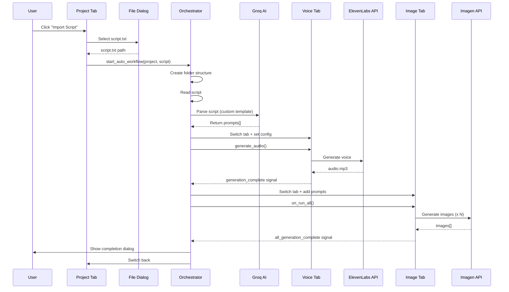

# 🎬 Auto Workflow Implementation Plan

## 🎯 Mục tiêu: Workflow Tự động 100%

```
Import Script.txt → Auto Voice → Auto Images → Done!
```

---

## 📋 Architecture Overview

### Current State:
- ✅ Tab Project: Create/manage projects
- ✅ Tab Voice: Generate voice (ElevenLabs)
- ✅ Tab Image: Generate images (Imagen/Gemini)
- ❌ **No automation** - Manual switching between tabs

### Target State:
```
Tab Project
  ↓ Import Script
  ├─ Create folder structure automatically
  ├─ Parse script with Groq AI
  ├─ Auto switch to Voice tab → Generate voice
  ├─ Auto switch to Image tab → Generate images
  └─ All outputs in project folder
```

---

## 🏗️ Implementation Plan

### Phase 1: Project Class Enhancement ✅ DONE
**File:** `GenVideoPro.py`

**Added fields to Project:**
```python
class Project:
    # Existing fields...
    
    # NEW: Channel automation settings
    channel_name: str = ""           # Tên kênh YouTube
    script_template: str = ""        # System prompt cho Groq AI
    num_prompts: int = 5             # Số prompts muốn tạo
    voice_id: str = ""               # ElevenLabs voice ID mặc định
    auto_workflow: bool = True       # Bật/tắt auto workflow
```

---

### Phase 2: Project Dialog UI Update
**File:** `GenVideoPro.py` - `ProjectDialog` class

**Add fields:**
- ✅ Channel Name (QLineEdit)
- ✅ Script Template (QTextEdit - multiline cho system prompt)
- ✅ Num Prompts (QSpinBox, 1-50)
- ✅ Voice ID (QComboBox - load từ ElevenLabs)
- ✅ Auto Workflow (QCheckBox)

**Layout:**
```
┌─────────────────────────────────┐
│ Project Name: [____________]    │
│ Description:  [____________]    │
│                                 │
│ ═══ Channel Settings ═══       │
│ Channel Name: [____________]    │
│ Voice ID: [▼ Voice Dropdown]   │
│ Num Prompts: [5▲▼]             │
│                                 │
│ Script Template:                │
│ ┌─────────────────────────┐    │
│ │ Groq system prompt...    │    │
│ │                          │    │
│ └─────────────────────────┘    │
│                                 │
│ [✓] Enable Auto Workflow        │
│                                 │
│      [Cancel]  [Save Project]   │
└─────────────────────────────────┘
```

---

### Phase 3: Tab Project UI Enhancement
**File:** `GenVideoPro.py` - `setup_project_tab()`

**Add components:**

1. **Import Script Button**
   ```python
   import_script_btn = QPushButton("📜 Import Script & Auto Generate")
   import_script_btn.clicked.connect(self.on_import_script_auto)
   ```

2. **Project Info Panel**
   - Show current project settings
   - Channel name, voice ID, num prompts
   - Editable inline

3. **Auto Workflow Status**
   ```
   ┌────────────────────────────────┐
   │ 📁 Current Project: My Channel │
   │ 🎤 Voice: Adam (ElevenLabs)    │
   │ 🎨 Images: 12 prompts           │
   │ ⚡ Auto Workflow: Enabled       │
   └────────────────────────────────┘
   ```

---

### Phase 4: Folder Structure Auto Creation
**Function:** `create_project_folder_structure()`

```python
def create_project_folder_structure(project: Project, script_path: str):
    """
    Create folder structure for project:
    
    C:\WorkFlow\
      ├─ [project_name]/
      │   ├─ script.txt          # Original script
      │   ├─ voice/              # Voice outputs
      │   │   └─ audio.mp3
      │   ├─ image/              # Image outputs
      │   │   ├─ 01_001.png
      │   │   ├─ 01_002.png
      │   │   └─ ...
      │   └─ video/              # Video outputs (future)
      │       └─ final.mp4
    """
    base_dir = WORKFLOW_ROOT / project.name
    base_dir.mkdir(parents=True, exist_ok=True)
    
    # Create subdirectories
    (base_dir / "voice").mkdir(exist_ok=True)
    (base_dir / "image").mkdir(exist_ok=True)
    (base_dir / "video").mkdir(exist_ok=True)
    
    # Copy script to project folder
    import shutil
    shutil.copy(script_path, base_dir / "script.txt")
    
    # Update project paths
    project.voice_output = str(base_dir / "voice")
    project.image_output = str(base_dir / "image")
    project.video_output = str(base_dir / "video")
    
    return base_dir
```

---

### Phase 5: Auto Workflow Orchestrator
**Class:** `AutoWorkflowOrchestrator`

**Purpose:** Coordinate automation across tabs

```python
class AutoWorkflowOrchestrator:
    """
    Orchestrate automatic workflow:
    Script → Parse → Voice → Images → Done
    """
    def __init__(self, main_window):
        self.main_window = main_window
        self.project = None
        self.script_text = ""
        self.prompts = []
        self.voice_path = None
        
    def start_auto_workflow(self, project: Project, script_path: str):
        """
        Main entry point for auto workflow
        """
        self.project = project
        
        # Step 1: Read script
        with open(script_path, 'r', encoding='utf-8') as f:
            self.script_text = f.read()
        
        # Step 2: Create folder structure
        project_dir = create_project_folder_structure(project, script_path)
        
        # Step 3: Parse script with Groq AI
        self.parse_script_with_groq()
        
    def parse_script_with_groq(self):
        """Parse script using Groq AI with custom template"""
        # Use project.script_template as system prompt
        # Use project.num_prompts for number of parts
        
        # Worker thread
        def worker():
            try:
                groq_keys = self._load_groq_keys()
                prompts = analyze_script_with_groq(
                    script=self.script_text,
                    num_parts=self.project.num_prompts,
                    groq_api_key=groq_keys[0],
                    custom_template=self.project.script_template  # NEW
                )
                
                self.prompts = prompts
                # Emit signal to continue workflow
                self.on_prompts_ready.emit()
            except Exception as e:
                self.on_error.emit(str(e))
        
        threading.Thread(target=worker, daemon=True).start()
    
    def on_prompts_ready(self):
        """Called when prompts are ready - start voice generation"""
        print(f"✅ Got {len(self.prompts)} prompts")
        
        # Auto switch to Voice tab and generate
        self.generate_voice()
    
    def generate_voice(self):
        """Auto generate voice in Voice tab"""
        # Switch to Voice tab
        self.main_window.tabs.setCurrentIndex(1)  # Voice tab index
        
        # Get ElevenLabs widget
        voice_widget = self.main_window.elevenlabs_widget
        
        # Set script text
        voice_widget.script_input.setPlainText(self.script_text)
        
        # Set voice ID from project
        voice_widget.set_voice_id(self.project.voice_id)
        
        # Set output folder
        voice_widget.set_output_folder(self.project.voice_output)
        
        # Trigger generation
        voice_widget.generate_audio()
        
        # Connect done signal
        voice_widget.generation_complete.connect(self.on_voice_done)
    
    def on_voice_done(self, audio_path: str):
        """Called when voice generation is complete"""
        self.voice_path = audio_path
        print(f"✅ Voice generated: {audio_path}")
        
        # Auto start image generation
        self.generate_images()
    
    def generate_images(self):
        """Auto generate images in Image tab"""
        # Switch to Image tab
        self.main_window.tabs.setCurrentIndex(2)  # Image tab index
        
        # Get Image widget
        image_widget = self.main_window.image_generator_widget
        
        # Set output folder
        image_widget.set_output_folder(self.project.image_output)
        
        # Clear existing rows
        image_widget.on_delete_all_rows()
        
        # Add all prompts to queue
        for prompt in self.prompts:
            image_widget.add_row(prompt)
        
        # Start generation
        image_widget.on_run_all()
        
        # Connect done signal
        image_widget.all_generation_complete.connect(self.on_images_done)
    
    def on_images_done(self):
        """Called when all images are generated"""
        print(f"✅ All images generated")
        
        # Show completion message
        QMessageBox.information(
            self.main_window,
            "Auto Workflow Complete!",
            f"✅ Workflow completed successfully!\n\n"
            f"📁 Project: {self.project.name}\n"
            f"🎤 Voice: {self.voice_path}\n"
            f"🎨 Images: {len(self.prompts)} generated\n\n"
            f"Output folder: {self.project.image_output}"
        )
        
        # Switch back to Project tab
        self.main_window.tabs.setCurrentIndex(0)
```

---

### Phase 6: Integration Points

#### A. MainWindow Modifications
```python
class MainWindow(QMainWindow):
    def __init__(self):
        super().__init__()
        
        # ... existing code ...
        
        # NEW: Auto workflow orchestrator
        self.orchestrator = AutoWorkflowOrchestrator(self)
    
    def on_import_script_auto(self):
        """Handle Import Script button in Project tab"""
        if not self.project_manager.current_project:
            QMessageBox.warning(self, "No Project", "Please select a project first!")
            return
        
        # File dialog to select script
        script_path, _ = QFileDialog.getOpenFileName(
            self, 
            "Import Script for Auto Workflow", 
            "", 
            "Text files (*.txt)"
        )
        
        if not script_path:
            return
        
        project = self.project_manager.current_project
        
        # Confirm
        reply = QMessageBox.question(
            self,
            "Start Auto Workflow?",
            f"This will automatically:\n\n"
            f"1. Create folder structure\n"
            f"2. Generate voice ({project.voice_id})\n"
            f"3. Generate {project.num_prompts} images\n\n"
            f"Continue?",
            QMessageBox.Yes | QMessageBox.No
        )
        
        if reply == QMessageBox.Yes:
            # Start auto workflow
            self.orchestrator.start_auto_workflow(project, script_path)
```

#### B. Image Tab Modifications
Add signal for completion:
```python
class ImageGeneratorTab(QWidget):
    all_generation_complete = Signal()  # NEW
    
    def on_all_done(self):
        # ... existing code ...
        
        # Emit completion signal
        self.all_generation_complete.emit()
```

#### C. Voice Tab Modifications (if needed)
Add signal for completion:
```python
class ElevenLabsGUI(QWidget):
    generation_complete = Signal(str)  # NEW: Emit audio path
    
    def on_generation_done(self, audio_path):
        # ... existing code ...
        
        # Emit completion signal
        self.generation_complete.emit(audio_path)
```

---

### Phase 7: Groq AI Script Template Support

**Modify `analyze_script_with_groq()` in `image_tab_full.py`:**

```python
def analyze_script_with_groq(
    script: str, 
    num_parts: int, 
    groq_api_key: str,
    custom_template: str = ""  # NEW parameter
) -> List[str]:
    """
    Analyze script with Groq AI
    
    custom_template: If provided, use this instead of default system prompt
    """
    
    # Use custom template if provided, otherwise use default
    if custom_template:
        system_prompt = custom_template
    else:
        system_prompt = """<default system prompt>..."""
    
    # Replace {x} placeholder with actual num_parts
    system_prompt = system_prompt.replace("{x}", str(num_parts))
    
    # ... rest of function ...
```

---

## 🔄 Complete Workflow Sequence



---

## 📁 Folder Structure Example

```
C:\WorkFlow\
├─ My_Cooking_Channel/
│   ├─ script.txt                    # Original script
│   ├─ voice/
│   │   └─ narration_20250130.mp3   # Generated voice
│   ├─ image/
│   │   ├─ 01_001.png                # Prompt 1, image 1
│   │   ├─ 01_002.png                # Prompt 1, image 2
│   │   ├─ 02_001.png                # Prompt 2, image 1
│   │   └─ ...                       # Total: num_prompts * images_per_prompt
│   └─ video/
│       └─ (future: final video)
│
├─ Motivational_Stories/
│   ├─ script.txt
│   ├─ voice/
│   ├─ image/
│   └─ video/
│
└─ settings/
    └─ projects.json
```

---

## ⚙️ Settings Example

**projects.json:**
```json
{
  "projects": [
    {
      "id": "uuid-123",
      "name": "My_Cooking_Channel",
      "description": "Cooking tutorials for YouTube",
      "created_at": "2025-01-30T10:00:00",
      "voice_output": "C:\\WorkFlow\\My_Cooking_Channel\\voice",
      "image_output": "C:\\WorkFlow\\My_Cooking_Channel\\image",
      "video_output": "C:\\WorkFlow\\My_Cooking_Channel\\video",
      
      "channel_name": "Chef's Kitchen",
      "voice_id": "adam_elevenlabs_id",
      "num_prompts": 12,
      "auto_workflow": true,
      "script_template": "You are a cooking video script analyzer. Create vivid, appetizing image prompts showing: food preparation, cooking steps, final dish presentation. Style: Ultra-realistic food photography, 16:9, bright natural lighting..."
    }
  ],
  "current_project_id": "uuid-123"
}
```

---

## 🎯 Benefits

✅ **100% Automation** - No manual switching
✅ **Project-based** - Each channel has own settings
✅ **Folder Organization** - Everything in one place
✅ **Custom Templates** - Different styles per channel
✅ **Voice Consistency** - Same voice per channel
✅ **Scalable** - Easy to add more channels

---

## 🚀 Next Steps

1. **Phase 1: ✅ Done** - Project class updated
2. **Phase 2:** Update ProjectDialog UI
3. **Phase 3:** Add Import button to Project tab
4. **Phase 4:** Implement folder creation
5. **Phase 5:** Build Orchestrator class
6. **Phase 6:** Connect all tabs
7. **Phase 7:** Add custom template support

---

## 📝 Notes

- **Error Handling**: Each step should have try/catch và fallback
- **Progress UI**: Show progress dialog during automation
- **Cancel Support**: Allow user to cancel workflow
- **Logging**: Log mọi steps để debug
- **Resume**: Nếu fail ở bước nào, có thể resume từ đó

---

**Estimated Time:** 4-6 hours implementation
**Complexity:** High (requires coordination across multiple components)
**Priority:** High (game-changing feature)


